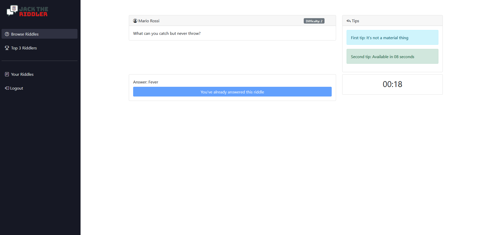

## React Client Application Routes

- Route `/riddle`: home page with all riddles, divided into open and closed
- Route `/riddle/:id`: page displaying the details of riddle with id equal to id, showing different content if the riddle is open or closed
- Route `/myriddle`: profile page of the logged user, displaying his infos and riddles with a button to create a new one
- Route `/myriddle/:id`: page displaying the details of user's riddle with id equal to id, showing different content if the riddle is open or closed
- Route `/bestusers`: page that shows the top-3 users based on their score and, in the event of a tie, the users with the top 3 scores
- Route `/login`: login page to access user-only content

## API Server

_NOTE: Most of the GET requests can return a code 304, if the entities they get haven't been modified._  
_This includes the GET requests to get riddles, users leaderboard the riddles countdown (when it hasn't started yet)_  
_The only GET request that can't return this code is the one to get a preview of the riddles, since it fetches random ones_  
_Specified here to avoid redundancy in the documentation_

- POST `/api/user/login`
  - request body: `email` and `password`
  - response body: user infos if login is successful, error message if not
  - response code: `200` if logged in, `401` if not  

- GET `/api/user/logout`
  - response body: `null`
  - response code: `200`
- GET `/api/user`
  - response body: user infos if logged in, unauth message if not
  - response code: `200` if logged in, `401` if not
- GET `/api/user/score`
  - response body: user's score if logged in, unauth message if not
  - response code: `200` if logged in, `401` if not, `500` if a database error happens
- GET `/api/user/best`
  - response body: top-3 users based on their score and, in the event of a tie, the users with the top 3 scores
  - response code: `200` if logged in, `401` if not, `503` if a database error happens
- GET `/api/user/riddle`
  - response body: user's riddles if logged in, unauth message if not
  - response code: `200` if logged in, `401` if not, `503` if a database error happens
- GET `/api/user/riddle/state`
  - response body: user's riddles states if logged in, unauth message if not
  - response code: `200` if logged in, `401` if not, `503` if a database error happens
- GET `/api/user/riddle/:id`
  - request parameter: `id` of the riddle
  - response body: user's riddle with id equal to id if logged in, unauth message if not
  - response code: `200` if logged in, `401` if not, `503` if a database error happens
- GET `/api/user/riddle/:id/countdown_answers`
  - request parameter: `id` of the riddle
  - response body: user's riddle with id equal to id's seconds left and current answers if logged in, unauth message if not
  - response code: `200` if logged in, `401` if not, `503` if riddle not found or belonging to another user

- GET `/api/riddle`
  - response body: all riddles NOT belonging to the logged user
  - response code: `200`, `503` if a database error happens
- GET `/api/riddle/preview`
  - response body: six random riddles
  - response code: `200`, `503` if a database error happens
- GET `/api/riddle/state`
  - response body: get all riddles (not belonging to the logged in user) states
  - response code: `200` if logged in, `401` if not, `503` if a database error happens
- GET `/api/riddle/:id`
  - request parameter: `id` of the riddle
  - response body: riddle with id equal to id if logged in, unauth message if not
  - response code: `200` if logged in, `401` if not, `503` if riddle not found or belonging to another user
- GET `/api/riddle/:id/countdown`
  - request parameter: `id` of the riddle
  - response body: riddle with id equal to id's seconds left if logged in, unauth message if not
  - response code: `200` if logged in, `401` if not, `503` if riddle not found
- GET `/api/riddle/:id/first_tip`
  - request parameter: `id` of the riddle
  - response body: first tip of the riddle with id equal to `id` if logged in, unauth message if not
  - response code: `200` if logged in, `401` if not, `503` if riddle not found
- GET `/api/riddle/:id/second_tip`
  - request parameter: `id` of the riddle
  - response body: second tip of the riddle with id equal to `id` if logged in, unauth message if not
  - response code: `200` if logged in, `401` if not, `503` if riddle not found
- POST `/api/riddle`
  - request body: `question`, `answer`, `difficulty`, `duration`, `firstTip`, `secondTip`
  - response body: empty if logged in, unauth message if not
  - response code: `201` if logged in, `401` if not, `503` if a database error happens
- POST `api/riddle/:id`
  - request parameter: `id` of the riddle
  - request body: `answer` to the riddle
  - response body: `correct_answer boolean` + `closed riddle data`(if closed_answer=true) if logged in, unauth message if not
  - response code: `201` if logged in, `401` if not, `503` if a database error happens

## Database Tables

_Primary keys are underlined and in bold, foreign keys are in bold_

- Table `user` - contains the user's infos stored in the following attributes 
	- (<ins>**id**</ins>, name, surname, score, email, hash, salt)
- Table `riddle` - contains the riddles created by the users:
	- (<ins>**id**</ins>, question, answer, difficulty, duration, firstTip, secondTip, state, expiry_date, **user_id**)
- Table `riddle_user` - contains the associations between the users and the riddles, representing the answers of the users to the riddles:
	- (<ins>**id**</ins>, **riddle_id**, **user_id**, answer)

## Main React Components

- `LoginForm` (in `LoginForm.js`): Login page for unauthenticated users
- `RiddlesView` (in `RiddlesView.js`): shows all the riddles not belonging to the logged user (if defined), divided into open and closed
- `RiddleSingle` (in `RiddleSingle.js`): show the details of a single riddle, displaying different content if the riddle is open or closed
- `OpenRiddle` (in `OpenRiddle.js`): show the details of an open riddle, displaying the countdown, tips and the answer of the user (if any)
- `UserRiddlesView` (in `UserRiddlesView.js`): shows all the riddles belonging to the logged user, together with the user's profile info and a button to create a new riddle
- `UserRiddleSingle` (in `UserRiddleSingle.js`): show the details of a single riddle belonging to the logged user, displaying different content if the riddle is open or closed
- `UserOpenRiddle` (in `UserOpenRiddle.js`): show the details of an open riddle belonging to the logged user, displaying the countdown and the replies of the users as they answer the riddle
- `BestUsers` (in `BestUsers.js`): shows the top-3 users based on their score and, in the event of a tie, the users with the top 3 scores
- `RiddleModal` (in `RiddleModal.js`): form to create a new riddle

(only _main_ components, minor ones may be skipped)

## Screenshot

## Users Credentials

- jack@polito.it, theriddler
- gabriele.palmeri@polito.it, riddler123
- giovanni.verdi@polito.it, riddler123
- luca.bruno@polito.it, riddler123
- mario.rossi@polito.it, riddler123
- john.doe@polito.it, riddler123
